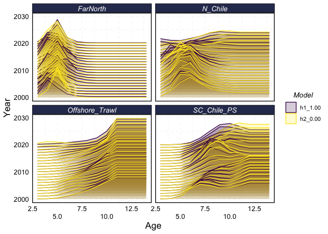
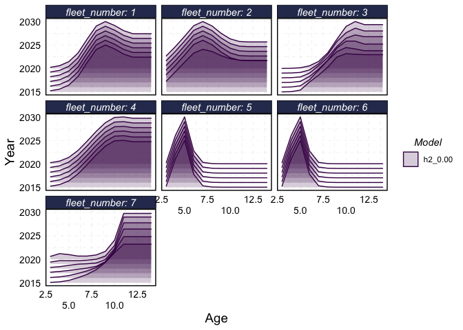
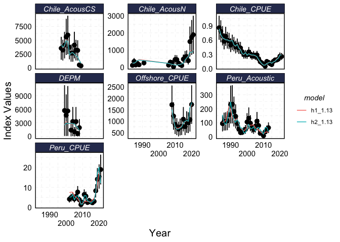
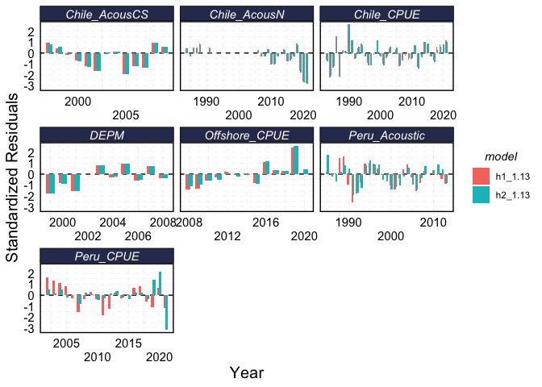
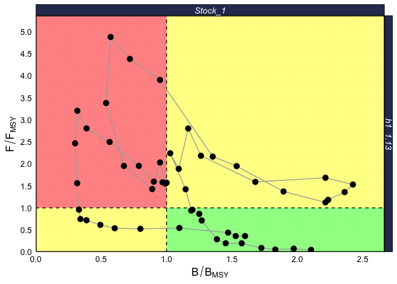
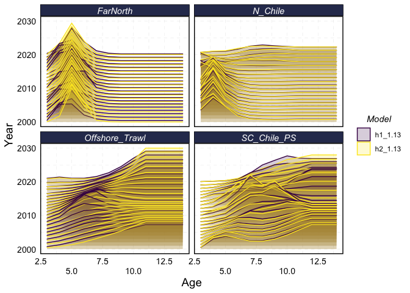
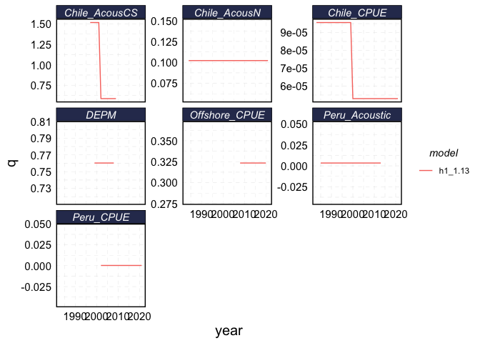

<!-- README.md is generated from README.Rmd. Please edit that file -->

# jjmR

``` r
getwd()
#> [1] "/Users/danovan/projects/jjmr/assessment"
```

<!-- badges: start -->
<!-- badges: end -->

The goal of jjmR is to … Graphics and diagnostics libraries for SPRFMO’s
JJM model adopted from IMARPE’s jjmTools

## Installation

You can install `jjmR` like so:

``` r
install.packages("devtools")
devtools::install_github("SPRFMO/jjmR")
```

## Basic Usage

`jjmR` provides support for objects of class `jm.output`. Reading in the
outputs of a JJM model with `jjmR` provides a number of summary and
plotting functions.

In order to run any of the `jjmR` functions for reading assessment
results, you need to make sure your working directory is set to the
location of the `assessment` folder.

``` r
library(here)
#> here() starts at /Users/danovan/projects/jjmr/assessment
library(jjmR)
# setwd(here("assessment"))


jjm_results <- readJJM("h2_1.13", path = "config", input = "input")

summary(jjm_results)
#> 
#> Parameter Table:
#> 
#> $h2_1.13
#>                   Stock_1_Reg_1 Stock_2_Reg_1 Stock_2_Reg_2
#> Natural Mortality     0.2800000     0.3300000     0.3300000
#> log_Linf              4.3870142     4.3870142     4.3870142
#> log_K                -1.8325815    -1.8325815    -1.8325815
#> log_Lo                2.7568404     2.7568404     2.7568404
#> log_sdAge            -2.4079456    -2.4079456    -2.4079456
#> mean_log_Rec          9.3051584     8.0942193     7.5349542
#> Steepness             0.6500000     0.6500000     0.6500000
#> log_Rzero             9.4493718     8.1595879     7.1279824
#> log_SigmaR           -0.5108256    -0.5108256    -0.5108256
#> 
#> 
#> Likelihood Table:
#> 
#>                  h2_1.13
#> catch_like          0.95
#> age_like_fsh      217.22
#> length_like_fsh   437.41
#> sel_like_fsh      179.35
#> ind_like          183.38
#> age_like_ind       61.86
#> length_like_ind     0.00
#> sel_like_ind       28.16
#> rec_like            6.07
#> fpen                0.03
#> post_priors_indq    0.20
#> post_priors         0.00
#> residual            0.10
#> total            1114.71
#> 
#> Summary Plot (s):
#> 
#> Stock_1
```


    #> Stock_2



``` r
plot(jjm_results)
```



## Example of tidying jjmR outputs

`jjmR` also includes a series of helper functions to “tidy” up the data
(see <https://r4ds.had.co.nz/tidy-data.html>). These are designed to
help users access and comapre results across multiple models and stocks.

First, let’s load up two different model runs. As always with `jjmR`,
make sure your working directory is set to the `assessment` folder.

``` r
library(jjmR)
library(ggplot2)
library(dplyr)
#> 
#> Attaching package: 'dplyr'
#> The following objects are masked from 'package:stats':
#> 
#>     filter, lag
#> The following objects are masked from 'package:base':
#> 
#>     intersect, setdiff, setequal, union
library(tidyr)
theme_set(theme_jjm(base_size = 15))
# example of code to generate model results
# model_results_1 <- runit(mod="h1_1.13",pdf=TRUE,est=TRUE,exec="../src/jjms")

# model_results_2 <- runit(mod="h2_1.13",pdf=TRUE,est=TRUE,exec="../src/jjms")

# read in a model run

model_results_1<- readJJM("h1_1.13", path = "config", input = "input")

model_results_2 <- readJJM("h2_1.13", path = "config", input = "input")

# compare to another model run

m1_v_m2 <- combineModels(model_results_1,model_results_2)
```

We can now use the `tidy_JJM` function to tidy up the results. As of now
`tidy_JJM` provides support for a number of the most commonly used
outputs of the JJM model, but not all.

`tidy_JJM` returns a list with objects for each tidied data type
(e.g. selectivities and msy_mt), with columns denoting the model, stock,
etc. for a given observation.

``` r
tidy_jjm <- tidy_JJM(m1_v_m2)
str(tidy_jjm)
#> List of 8
#>  $ age_fits         : tibble [2,736 × 9] (S3: tbl_df/tbl/data.frame)
#>   ..$ model       : chr [1:2736] "h1_1.13" "h1_1.13" "h1_1.13" "h1_1.13" ...
#>   ..$ stock       : chr [1:2736] "Stock_1" "Stock_1" "Stock_1" "Stock_1" ...
#>   ..$ fleet_type  : chr [1:2736] "fsh" "fsh" "fsh" "fsh" ...
#>   ..$ fleet_number: int [1:2736] 1 1 1 1 1 1 1 1 1 1 ...
#>   ..$ year        : num [1:2736] 1980 1980 1980 1980 1980 1980 1980 1980 1980 1980 ...
#>   ..$ age         : num [1:2736] 1 2 3 4 5 6 7 8 9 10 ...
#>   ..$ predicted   : num [1:2736] 0.0237 0.0889 0.1637 0.2124 0.2444 ...
#>   ..$ observed    : num [1:2736] 0.00415 0.04683 0.13615 0.24455 0.30796 ...
#>   ..$ fleet_name  : chr [1:2736] "N_Chile" "N_Chile" "N_Chile" "N_Chile" ...
#>  $ catchabilities   :'data.frame':   324 obs. of  8 variables:
#>   ..$ model       : chr [1:324] "h1_1.13" "h1_1.13" "h1_1.13" "h1_1.13" ...
#>   ..$ stock       : chr [1:324] "Stock_1" "Stock_1" "Stock_1" "Stock_1" ...
#>   ..$ metric      : chr [1:324] "q" "q" "q" "q" ...
#>   ..$ fleet_number: int [1:324] 1 1 1 1 1 1 1 1 1 1 ...
#>   ..$ year        : num [1:324] 1997 1998 1999 2000 2001 ...
#>   ..$ q           : num [1:324] 1.52 1.52 1.52 1.52 1.52 ...
#>   ..$ fleet_type  : chr [1:324] "ind" "ind" "ind" "ind" ...
#>   ..$ fleet_name  : chr [1:324] "Chile_AcousCS" "Chile_AcousCS" "Chile_AcousCS" "Chile_AcousCS" ...
#>  $ fishing_mortality: grouped_df [1,872 × 5] (S3: grouped_df/tbl_df/tbl/data.frame)
#>   ..$ model    : chr [1:1872] "h1_1.13" "h1_1.13" "h1_1.13" "h1_1.13" ...
#>   ..$ stock    : chr [1:1872] "Stock_1" "Stock_1" "Stock_1" "Stock_1" ...
#>   ..$ year     : int [1:1872] 1970 1970 1970 1970 1970 1970 1970 1970 1970 1970 ...
#>   ..$ age      : num [1:1872] 1 2 3 4 5 6 7 8 9 10 ...
#>   ..$ mortality: num [1:1872] 0.000377 0.001762 0.00497 0.010374 0.021999 ...
#>   ..- attr(*, "groups")= tibble [2 × 2] (S3: tbl_df/tbl/data.frame)
#>   .. ..$ stock: chr [1:2] "Stock_1" "Stock_2"
#>   .. ..$ .rows: list<int> [1:2] 
#>   .. .. ..$ : int [1:1248] 1 2 3 4 5 6 7 8 9 10 ...
#>   .. .. ..$ : int [1:624] 1249 1250 1251 1252 1253 1254 1255 1256 1257 1258 ...
#>   .. .. ..@ ptype: int(0) 
#>   .. ..- attr(*, ".drop")= logi TRUE
#>  $ index_fits       :'data.frame':   288 obs. of  13 variables:
#>   ..$ model           : chr [1:288] "h1_1.13" "h1_1.13" "h1_1.13" "h1_1.13" ...
#>   ..$ stock           : chr [1:288] "Stock_1" "Stock_1" "Stock_1" "Stock_1" ...
#>   ..$ type            : chr [1:288] "Obs" "Obs" "Obs" "Obs" ...
#>   ..$ index_type      : chr [1:288] "Survey" "Survey" "Survey" "Survey" ...
#>   ..$ fleet_number    : int [1:288] 1 1 1 1 1 1 1 1 1 1 ...
#>   ..$ year            : num [1:288] 1997 1998 1999 2000 2001 ...
#>   ..$ observed_ind    : num [1:288] 3530 3200 4100 5600 5950 ...
#>   ..$ pred_ind        : num [1:288] 4339 3578 3957 5020 4901 ...
#>   ..$ observed_se     : num [1:288] 1059 960 1230 1680 1785 ...
#>   ..$ pearson_resid   : num [1:288] -0.764 -0.394 0.116 0.345 0.588 ...
#>   ..$ something_resids: num [1:288] -0.703 -0.381 0.121 0.372 0.661 ...
#>   ..$ fleet_type      : chr [1:288] "ind" "ind" "ind" "ind" ...
#>   ..$ fleet_name      : chr [1:288] "Chile_AcousCS" "Chile_AcousCS" "Chile_AcousCS" "Chile_AcousCS" ...
#>  $ msy_mt           :'data.frame':   156 obs. of  15 variables:
#>   ..$ model     : chr [1:156] "h1_1.13" "h1_1.13" "h1_1.13" "h1_1.13" ...
#>   ..$ stock     : chr [1:156] "Stock_1" "Stock_1" "Stock_1" "Stock_1" ...
#>   ..$ year      : num [1:156] 1970 1971 1972 1973 1974 ...
#>   ..$ fspr      : num [1:156] 0.939 0.908 0.935 0.897 0.8 ...
#>   ..$ survivespr: num [1:156] 0.0612 0.0921 0.0653 0.1026 0.1998 ...
#>   ..$ f_fmsy    : num [1:156] 0.0478 0.0739 0.0555 0.0918 0.1975 ...
#>   ..$ fmsy      : num [1:156] 0.194 0.193 0.172 0.163 0.157 ...
#>   ..$ f         : num [1:156] 0.00926 0.01425 0.00956 0.01495 0.03103 ...
#>   ..$ fsprmsy   : num [1:156] 0.398 0.397 0.399 0.395 0.396 ...
#>   ..$ msy       : num [1:156] 1186 1195 1228 1265 1298 ...
#>   ..$ msyl      : num [1:156] 0.305 0.303 0.305 0.301 0.302 ...
#>   ..$ bmsy      : num [1:156] 7112 7078 7119 7018 7043 ...
#>   ..$ bzero     : num [1:156] 23345 23345 23345 23345 23345 ...
#>   ..$ ssb       : num [1:156] 14975 13967 13043 12110 11094 ...
#>   ..$ b_bmsy    : num [1:156] 2.11 1.97 1.83 1.73 1.58 ...
#>  $ recruits         :'data.frame':   156 obs. of  8 variables:
#>   ..$ model         : chr [1:156] "h1_1.13" "h1_1.13" "h1_1.13" "h1_1.13" ...
#>   ..$ stock         : chr [1:156] "Stock_1" "Stock_1" "Stock_1" "Stock_1" ...
#>   ..$ year          : num [1:156] 1970 1971 1972 1973 1974 ...
#>   ..$ recruits      : num [1:156] 6102 5681 5264 4671 4653 ...
#>   ..$ str_error     : num [1:156] 2823 2553 2299 1971 1785 ...
#>   ..$ lower_recruits: num [1:156] 2530 2409 2282 2079 2218 ...
#>   ..$ upper_recruits: num [1:156] 14722 13396 12142 10496 9763 ...
#>   ..$ rec_dev       : num [1:156] -0.667 -0.738 -0.815 -0.934 -0.938 ...
#>  $ selectivities    : tibble [13,728 × 10] (S3: tbl_df/tbl/data.frame)
#>   ..$ model       : chr [1:13728] "h1_1.13" "h1_1.13" "h1_1.13" "h1_1.13" ...
#>   ..$ stock       : chr [1:13728] "Stock_1" "Stock_1" "Stock_1" "Stock_1" ...
#>   ..$ sel         : chr [1:13728] "sel" "sel" "sel" "sel" ...
#>   ..$ fleet_type  : chr [1:13728] "fsh" "fsh" "fsh" "fsh" ...
#>   ..$ fleet_number: int [1:13728] 1 1 1 1 1 1 1 1 1 1 ...
#>   ..$ index       : num [1:13728] 1 1 1 1 1 1 1 1 1 1 ...
#>   ..$ year        : num [1:13728] 1970 1970 1970 1970 1970 1970 1970 1970 1970 1970 ...
#>   ..$ age         : int [1:13728] 3 4 5 6 7 8 9 10 11 12 ...
#>   ..$ selectivity : num [1:13728] 0.0242 0.121 0.3386 0.968 2.459 ...
#>   ..$ fleet_name  : chr [1:13728] "N_Chile" "N_Chile" "N_Chile" "N_Chile" ...
#>  $ totals           :'data.frame':   510 obs. of  8 variables:
#>   ..$ model     : chr [1:510] "h1_1.13" "h1_1.13" "h1_1.13" "h1_1.13" ...
#>   ..$ stock     : chr [1:510] "Stock_1" "Stock_1" "Stock_1" "Stock_1" ...
#>   ..$ metric    : chr [1:510] "TotBiom" "TotBiom" "TotBiom" "TotBiom" ...
#>   ..$ year      : num [1:510] 1970 1971 1972 1973 1974 ...
#>   ..$ value     : num [1:510] 19362 18126 16860 15694 14576 ...
#>   ..$ stdev     : num [1:510] 2800 2593 2385 2175 1967 ...
#>   ..$ lowerbound: num [1:510] 14520 13635 12723 11910 11142 ...
#>   ..$ upperbound: num [1:510] 25818 24095 22342 20680 19068 ...
```

This tidy form is useful for users wishing to quickly generate new plots
or analyses based on the results of different model runs.

For example, suppose we want to plot the predicted index values for each
of the indicies across models, as well as the residuals.

``` r
index_fits <- tidy_jjm$index_fits

index_fits %>% 
  ggplot() + 
  geom_pointrange(aes(year, observed_ind, ymin = observed_ind - 1.96 * observed_se, ymax =  observed_ind + 1.96 * observed_se)) +
  geom_path(aes(year, pred_ind, color = model)) + 
  facet_wrap(~ fleet_name, scales = "free_y") + 
  scale_x_continuous(name = "Year", guide = guide_axis(n.dodge = 2)) + 
  scale_y_continuous(name = "Index Values")
```



``` r
index_fits %>% 
  mutate(residual = pred_ind - observed_ind ) %>% 
  group_by(fleet_name, model) %>% 
  mutate(standardized_residual = residual / sd(residual)) %>% 
  filter(!is.na(standardized_residual)) %>% 
  ggplot() + 
  geom_hline(yintercept = 0,linetype = 2) +
  geom_col(aes(x = year, y =standardized_residual, fill =model), position = position_dodge(width = 0.5)) +
  facet_wrap(~ fleet_name, scales = "free_x") + 
  scale_x_continuous(name = "Year", guide = guide_axis(n.dodge = 2)) + 
  scale_y_continuous(name = "Standardized Residuals")
```



### Using `get_` Functions: Plotting Selectivities

You can also access the helper functions the underly `tidy_JJM`
directly. Each of these is named `get_X`, where `X` is the name of the
data.

For example, to access the estimated selectivity ogives ,we can use
`get_selectivities`.

``` r

selectivities <- get_selectivities(m1_v_m2)

head(selectivities)
#> # A tibble: 6 × 10
#>   model   stock   sel   fleet_type fleet_number index  year   age selectivity
#>   <chr>   <chr>   <chr> <chr>             <int> <dbl> <dbl> <int>       <dbl>
#> 1 h1_1.13 Stock_1 sel   fsh                   1     1  1970     3      0.0242
#> 2 h1_1.13 Stock_1 sel   fsh                   1     1  1970     4      0.121 
#> 3 h1_1.13 Stock_1 sel   fsh                   1     1  1970     5      0.339 
#> 4 h1_1.13 Stock_1 sel   fsh                   1     1  1970     6      0.968 
#> 5 h1_1.13 Stock_1 sel   fsh                   1     1  1970     7      2.46  
#> 6 h1_1.13 Stock_1 sel   fsh                   1     1  1970     8      3.21  
#> # … with 1 more variable: fleet_name <chr>
```

Selectivities alone have a dedicated plotting function added to them by
the “tidy” functions of `jjmR`. You can use this by running
`plot_selectivities`, or by calling `plot` directly.

``` r
plot_selectivities(selectivities)
```



``` r
plot(m1_v_m2,what="selectivity",fleet="fsh", alpha = 0.2, scale = 10,
     years = 2000:2020)
```



``` r

plot(model_results_2,what="selectivity",fleet="ind", alpha = 0.2, scale = 10,
     years = 2015:2020)
```


### Miscelanneous Examples

``` r
msy_my_results = get_msy_mt(m1_v_m2)

head(msy_my_results)
#>     model   stock year    fspr survivespr  f_fmsy    fmsy       f fsprmsy
#> 1 h1_1.13 Stock_1 1970 0.93883    0.06117 0.04775 0.19387 0.00926 0.39827
#> 2 h1_1.13 Stock_1 1971 0.90789    0.09211 0.07387 0.19295 0.01425 0.39700
#> 3 h1_1.13 Stock_1 1972 0.93468    0.06532 0.05551 0.17223 0.00956 0.39851
#> 4 h1_1.13 Stock_1 1973 0.89745    0.10255 0.09177 0.16290 0.01495 0.39476
#> 5 h1_1.13 Stock_1 1974 0.80025    0.19975 0.19747 0.15713 0.03103 0.39570
#> 6 h1_1.13 Stock_1 1975 0.78939    0.21061 0.19796 0.17709 0.03506 0.39661
#>        msy    msyl     bmsy    bzero      ssb  b_bmsy
#> 1 1185.945 0.30467 7112.403 23344.93 14975.36 2.10553
#> 2 1195.226 0.30321 7078.308 23344.93 13967.12 1.97323
#> 3 1228.022 0.30494 7118.856 23344.93 13043.27 1.83221
#> 4 1264.748 0.30061 7017.823 23344.93 12109.89 1.72559
#> 5 1298.217 0.30169 7043.001 23344.93 11093.99 1.57518
#> 6 1205.963 0.30274 7067.550 23344.93 10266.56 1.45263

kobe(model_results_1, engine = "ggplot")
```


``` r
qs = get_catchabilities(model_results_1)

qs %>% 
  ggplot(aes(year, q, color = model)) + 
  geom_line() + 
  facet_wrap(~ fleet_name, scales = "free_y")
```



``` r

totals <- get_totals(m1_v_m2)

totals %>% 
  ggplot(aes(year, value, color = stock, linetype = model)) + 
  geom_line() + 
  facet_wrap(~ metric, scales = "free_y")
```


``` r

index_fits <- get_index_fits(m1_v_m2)

index_fits %>% 
  ggplot() + 
  geom_pointrange(aes(year, observed_ind, ymin = observed_ind - 1.96 * observed_se, ymax =  observed_ind + 1.96 * observed_se)) +
  geom_path(aes(year, pred_ind, color = model)) + 
  facet_wrap(~ fleet_name, scales = "free_y")
```


``` r

age_fits <- get_age_fits(m1_v_m2)


age_fits %>% 
  filter(model == "h2_1.13", stock == "Stock_1", year > 2015) %>% 
  pivot_longer(predicted:observed) %>% 
  ggplot() + 
  geom_density(aes(age, value, fill = name),stat = "identity", alpha = 0.5) + 
  facet_grid(year~fleet_name)
```


``` r

recruits <- get_recruits(m1_v_m2)

recruits %>% 
  ggplot() + 
  geom_ribbon(aes(year, ymin = lower_recruits, ymax = upper_recruits, fill = stock),alpha = 0.5) + 
  geom_line(aes(year, recruits, color = stock)) + 
  facet_wrap(~model)
```


``` r


fishing_mortality <- get_fishing_mortality(m1_v_m2)

fishing_mortality %>% 
  ggplot(aes(year, mortality, color = age, group = age)) + 
  geom_line() + 
  facet_grid(model~stock)
```


