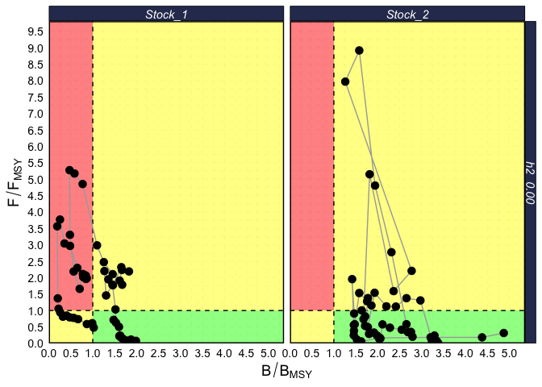
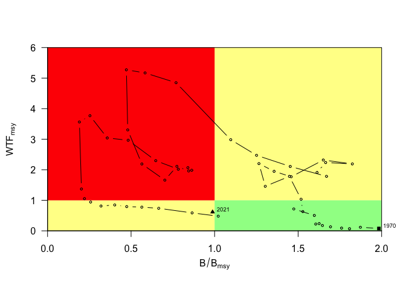
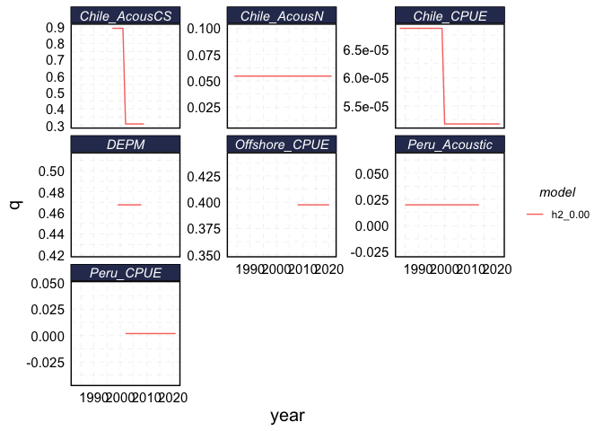
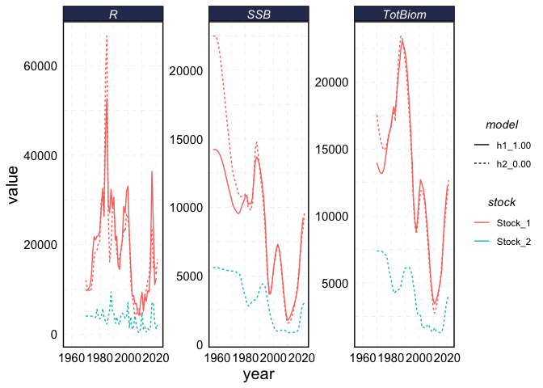
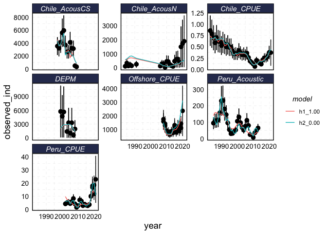
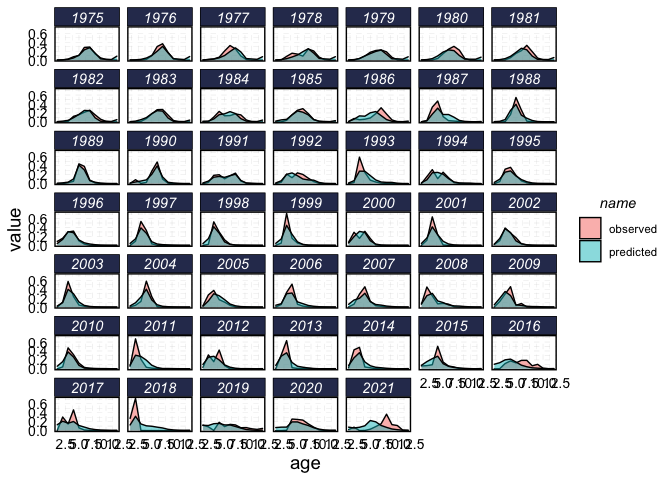
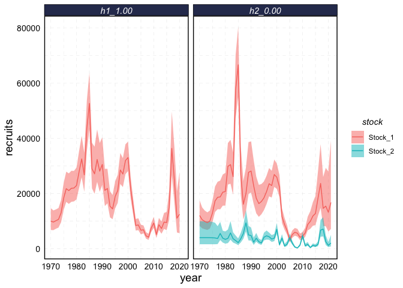
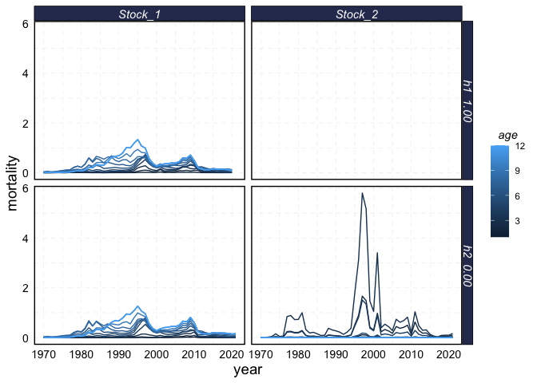

<!-- README.md is generated from README.Rmd. Please edit that file -->

# jjmR

<!-- badges: start -->
<!-- badges: end -->

The goal of jjmR is to … Graphics and diagnostics libraries for SPRFMO’s
JJM model adopted from IMARPE’s jjmTools

## Installation

You can install the development version of jjmR like so:

``` r
install.packages("devtools")
devtools::install_github("danovando/jjmR@dev")
```

## Example of tidying jjm outputs

This is a quick and dirty example of how to use new features of `jjmR`
to tidy and analyze results of JJM model that will get cleaned up.

``` r
library(here)
#> here() starts at /Users/danovan/projects/jjmr
library(ggplot2)
library(tidyverse)
#> ── Attaching packages ─────────────────────────────────────── tidyverse 1.3.1 ──
#> ✔ tibble  3.1.7     ✔ dplyr   1.0.9
#> ✔ tidyr   1.2.0     ✔ stringr 1.4.0
#> ✔ readr   2.1.2     ✔ forcats 0.5.1
#> ✔ purrr   0.3.4
#> ── Conflicts ────────────────────────────────────────── tidyverse_conflicts() ──
#> ✖ dplyr::filter() masks stats::filter()
#> ✖ dplyr::lag()    masks stats::lag()
library(jjmR)
theme_set(theme_jjm())
setwd(here("assessment"))

# read in a model run
# mod0.00 <- runit(mod="h2_0.00",pdf=TRUE,est=TRUE,exec="../src/jjms")


mod0.00 <- readJJM("h2_0.00", path = "config", input = "input")

# compare to a past model run
load("results/mod_prev_h1.Rdat")

old_vs_new_mods <- combineModels(mod0.00,mod_prev)


selectivities <- get_selectivities(old_vs_new_mods)


plot_selectivities(selectivities)
```


``` r

plot(old_vs_new_mods,what="selectivity",fleet="fsh", alpha = 0.2, scale = 10,
     years = 2000:2020)
```


``` r

plot(mod0.00,what="selectivity",fleet="ind", alpha = 0.2, scale = 10,
     years = 2015:2020)
```


``` r
a = get_msy_mt(old_vs_new_mods)

kobe(mod0.00, engine = "ggplot")
```



``` r
kobe(old_vs_new_mods, engine = "lattice")
```



``` r
qs = get_catchabilities(mod0.00)


qs %>% 
  ggplot(aes(year, q, color = model)) + 
  geom_line() + 
  facet_wrap(~ fleet_name, scales = "free_y")
```



``` r

totals <- get_totals(old_vs_new_mods)


totals %>% 
  ggplot(aes(year, value, color = stock, linetype = model)) + 
  geom_line() + 
  facet_wrap(~ metric, scales = "free_y")
```



``` r

index_fits <- get_index_fits(old_vs_new_mods)

index_fits %>% 
  ggplot() + 
  geom_pointrange(aes(year, observed_ind, ymin = observed_ind - 1.96 * observed_se, ymax =  observed_ind + 1.96 * observed_se)) +
  geom_path(aes(year, pred_ind, color = model)) + 
  facet_wrap(~ fleet_name, scales = "free_y")
```



``` r

age_fits <- get_age_fits(old_vs_new_mods)


age_fits %>% 
  filter(model == "h2_0.00", stock == "Stock_1", source == "fsh_1") %>% 
  pivot_longer(predicted:observed) %>% 
  ggplot() + 
  geom_density(aes(age, value, fill = name),stat = "identity", alpha = 0.5) + 
  facet_wrap(~year)
```



``` r

recruits <- get_recruits(old_vs_new_mods)

recruits %>% 
  ggplot() + 
  geom_ribbon(aes(year, ymin = lower_recruits, ymax = upper_recruits, fill = stock),alpha = 0.5) + 
  geom_line(aes(year, recruits, color = stock)) + 
  facet_wrap(~model)
```



``` r


fishing_mortality <- get_fishing_mortality(old_vs_new_mods)

fishing_mortality %>% 
  ggplot(aes(year, mortality, color = age, group = age)) + 
  geom_line() + 
  facet_grid(model~stock)
```



``` r
tidy_jjm <- tidy_JJM(old_vs_new_mods)
str(tidy_jjm)
#> List of 8
#>  $ age_fits         : tibble [3,816 × 7] (S3: tbl_df/tbl/data.frame)
#>   ..$ model    : chr [1:3816] "h2_0.00" "h2_0.00" "h2_0.00" "h2_0.00" ...
#>   ..$ stock    : chr [1:3816] "Stock_1" "Stock_1" "Stock_1" "Stock_1" ...
#>   ..$ source   : chr [1:3816] "fsh_1" "fsh_1" "fsh_1" "fsh_1" ...
#>   ..$ year     : num [1:3816] 1975 1975 1975 1975 1975 ...
#>   ..$ age      : num [1:3816] 1 2 3 4 5 6 7 8 9 10 ...
#>   ..$ predicted: num [1:3816] 0.00279 0.00587 0.01635 0.04886 0.11046 ...
#>   ..$ observed : num [1:3816] 0 0.00697 0.02357 0.07554 0.1038 ...
#>  $ catchabilities   :'data.frame':   320 obs. of  8 variables:
#>   ..$ model       : chr [1:320] "h2_0.00" "h2_0.00" "h2_0.00" "h2_0.00" ...
#>   ..$ stock       : chr [1:320] "Stock_1" "Stock_1" "Stock_1" "Stock_1" ...
#>   ..$ metric      : chr [1:320] "q" "q" "q" "q" ...
#>   ..$ fleet_number: int [1:320] 1 1 1 1 1 1 1 1 1 1 ...
#>   ..$ year        : num [1:320] 1997 1998 1999 2000 2001 ...
#>   ..$ q           : num [1:320] 0.891 0.891 0.891 0.891 0.891 ...
#>   ..$ fleet_type  : chr [1:320] "ind" "ind" "ind" "ind" ...
#>   ..$ fleet_name  : chr [1:320] "Chile_AcousCS" "Chile_AcousCS" "Chile_AcousCS" "Chile_AcousCS" ...
#>  $ fishing_mortality: grouped_df [1,860 × 5] (S3: grouped_df/tbl_df/tbl/data.frame)
#>   ..$ model    : chr [1:1860] "h2_0.00" "h2_0.00" "h2_0.00" "h2_0.00" ...
#>   ..$ stock    : chr [1:1860] "Stock_1" "Stock_1" "Stock_1" "Stock_1" ...
#>   ..$ year     : int [1:1860] 1970 1970 1970 1970 1970 1970 1970 1970 1970 1970 ...
#>   ..$ age      : num [1:1860] 1 2 3 4 5 6 7 8 9 10 ...
#>   ..$ mortality: num [1:1860] 6.27e-05 2.27e-04 8.90e-04 3.26e-03 8.89e-03 ...
#>   ..- attr(*, "groups")= tibble [2 × 2] (S3: tbl_df/tbl/data.frame)
#>   .. ..$ stock: chr [1:2] "Stock_1" "Stock_2"
#>   .. ..$ .rows: list<int> [1:2] 
#>   .. .. ..$ : int [1:1236] 1 2 3 4 5 6 7 8 9 10 ...
#>   .. .. ..$ : int [1:624] 625 626 627 628 629 630 631 632 633 634 ...
#>   .. .. ..@ ptype: int(0) 
#>   .. ..- attr(*, ".drop")= logi TRUE
#>  $ index_fits       :'data.frame':   284 obs. of  13 variables:
#>   ..$ model           : chr [1:284] "h2_0.00" "h2_0.00" "h2_0.00" "h2_0.00" ...
#>   ..$ stock           : chr [1:284] "Stock_1" "Stock_1" "Stock_1" "Stock_1" ...
#>   ..$ type            : chr [1:284] "Obs" "Obs" "Obs" "Obs" ...
#>   ..$ index_type      : chr [1:284] "Survey" "Survey" "Survey" "Survey" ...
#>   ..$ fleet_number    : int [1:284] 1 1 1 1 1 1 1 1 1 1 ...
#>   ..$ year            : num [1:284] 1997 1998 1999 2000 2001 ...
#>   ..$ observed_ind    : num [1:284] 3530 3200 4100 5600 5950 ...
#>   ..$ pred_ind        : num [1:284] 4355 3568 3744 4775 5498 ...
#>   ..$ observed_se     : num [1:284] 706 640 820 1120 1190 ...
#>   ..$ pearson_resid   : num [1:284] -1.169 -0.574 0.434 0.737 0.38 ...
#>   ..$ something_resids: num [1:284] -1.06 -0.549 0.458 0.805 0.399 ...
#>   ..$ fleet_type      : chr [1:284] "ind" "ind" "ind" "ind" ...
#>   ..$ fleet_name      : chr [1:284] "Chile_AcousCS" "Chile_AcousCS" "Chile_AcousCS" "Chile_AcousCS" ...
#>  $ msy_mt           :'data.frame':   155 obs. of  15 variables:
#>   ..$ model     : chr [1:155] "h2_0.00" "h2_0.00" "h2_0.00" "h2_0.00" ...
#>   ..$ stock     : chr [1:155] "Stock_1" "Stock_1" "Stock_1" "Stock_1" ...
#>   ..$ year      : num [1:155] 1970 1971 1972 1973 1974 ...
#>   ..$ fspr      : num [1:155] 0.911 0.872 0.921 0.899 0.857 ...
#>   ..$ survivespr: num [1:155] 0.089 0.1284 0.0794 0.1007 0.1427 ...
#>   ..$ f_fmsy    : num [1:155] 0.0785 0.1167 0.0696 0.09 0.1314 ...
#>   ..$ fmsy      : num [1:155] 0.133 0.133 0.133 0.132 0.133 ...
#>   ..$ f         : num [1:155] 0.01041 0.01549 0.00924 0.01192 0.01742 ...
#>   ..$ fsprmsy   : num [1:155] 0.394 0.394 0.393 0.392 0.394 ...
#>   ..$ msy       : num [1:155] 1010 1010 992 984 1004 ...
#>   ..$ msyl      : num [1:155] 0.3 0.3 0.299 0.297 0.299 ...
#>   ..$ bmsy      : num [1:155] 6745 6745 6720 6688 6732 ...
#>   ..$ bzero     : num [1:155] 22488 22488 22488 22488 22488 ...
#>   ..$ ssb       : num [1:155] 13380 12632 12147 11773 11404 ...
#>   ..$ b_bmsy    : num [1:155] 1.98 1.87 1.81 1.76 1.69 ...
#>  $ recruits         :'data.frame':   155 obs. of  8 variables:
#>   ..$ model         : chr [1:155] "h2_0.00" "h2_0.00" "h2_0.00" "h2_0.00" ...
#>   ..$ stock         : chr [1:155] "Stock_1" "Stock_1" "Stock_1" "Stock_1" ...
#>   ..$ year          : num [1:155] 1970 1971 1972 1973 1974 ...
#>   ..$ recruits      : num [1:155] 12041 10512 9896 9480 10073 ...
#>   ..$ str_error     : num [1:155] 2269 1868 1677 1573 1616 ...
#>   ..$ lower_recruits: num [1:155] 8288 7387 7068 6818 7323 ...
#>   ..$ upper_recruits: num [1:155] 17494 14958 13855 13181 13856 ...
#>   ..$ rec_dev       : num [1:155] -0.0992 -0.235 -0.2954 -0.3383 -0.2777 ...
#>  $ selectivities    : tibble [13,596 × 10] (S3: tbl_df/tbl/data.frame)
#>   ..$ model       : chr [1:13596] "h2_0.00" "h2_0.00" "h2_0.00" "h2_0.00" ...
#>   ..$ stock       : chr [1:13596] "Stock_1" "Stock_1" "Stock_1" "Stock_1" ...
#>   ..$ sel         : chr [1:13596] "sel" "sel" "sel" "sel" ...
#>   ..$ fleet_type  : chr [1:13596] "fsh" "fsh" "fsh" "fsh" ...
#>   ..$ fleet_number: int [1:13596] 1 1 1 1 1 1 1 1 1 1 ...
#>   ..$ index       : num [1:13596] 1 1 1 1 1 1 1 1 1 1 ...
#>   ..$ year        : num [1:13596] 1970 1970 1970 1970 1970 1970 1970 1970 1970 1970 ...
#>   ..$ age         : int [1:13596] 3 4 5 6 7 8 9 10 11 12 ...
#>   ..$ selectivity : num [1:13596] 0.00642 0.02189 0.0816 0.29519 0.80005 ...
#>   ..$ fleet_name  : chr [1:13596] "N_Chile" "N_Chile" "N_Chile" "N_Chile" ...
#>  $ totals           :'data.frame':   507 obs. of  8 variables:
#>   ..$ model     : chr [1:507] "h2_0.00" "h2_0.00" "h2_0.00" "h2_0.00" ...
#>   ..$ stock     : chr [1:507] "Stock_1" "Stock_1" "Stock_1" "Stock_1" ...
#>   ..$ metric    : chr [1:507] "TotBiom" "TotBiom" "TotBiom" "TotBiom" ...
#>   ..$ year      : num [1:507] 1970 1971 1972 1973 1974 ...
#>   ..$ value     : num [1:507] 17548 16719 16003 15508 15122 ...
#>   ..$ stdev     : num [1:507] 1814 1757 1701 1642 1580 ...
#>   ..$ lowerbound: num [1:507] 14279 13558 12946 12556 12277 ...
#>   ..$ upperbound: num [1:507] 21566 20618 19781 19153 18626 ...
```
